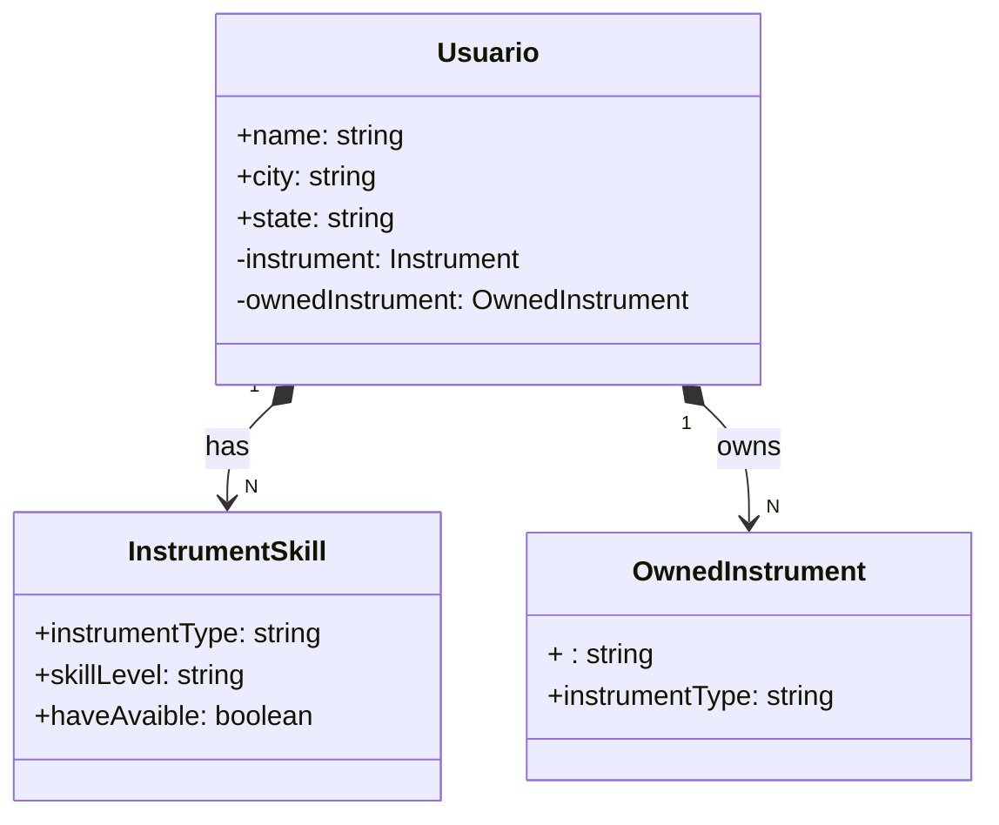

# APIGoJam
Um projeto de API usando Java e SpringBoot, para futuro aprimoramento e uso na nova GoJam

##Diagrama de Classes

```mermaid

classDiagram
  class Usuario {
    +name: string
    +city: string
    +state: string
    -instrument: Instrument
    -ownedInstrument: OwnedInstrument
  }

  class InstrumentSkill {
    +instrumentType: string
    +skillLevel: string
    +haveAvaible: boolean
  }

  class OwnedInstrument {
    + : string
    +instrumentType: string
  }

  Usuario "1" *--> "N" InstrumentSkill : has
  Usuario "1" *--> "N" OwnedInstrument : owns
```
